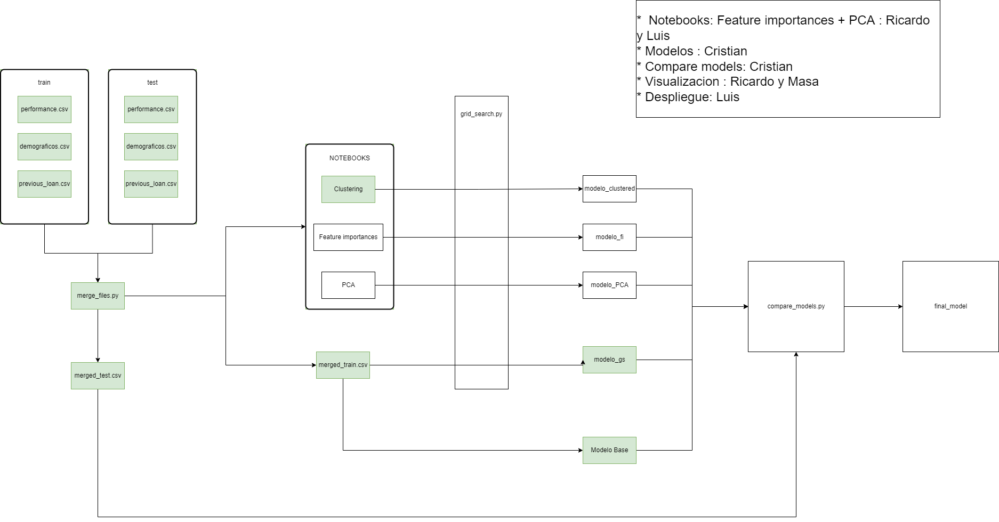

# G6_DP3

## Project structure

```
├───data                      # Contiene todos los datos usados en el proyecto
│   ├───hp                    # Mejores hiperparametros por modelo
│   ├───input                 
│   │   ├───merged_data       # Datos preprocesados
│   │   └───raw_data          # Datos en crudo
│   │
│   └───models                # Modelos serializados
│
├───notebooks                 # Notebooks utilizados en clustering, feature selection y PCA
│
└───src                       # Código generado
│   ├───model
│   │       baseline.py       # Modelo baseline
│   │       grid_search.py    # Obtención de mejores hiperparámetros
│   │
│   ├───preprocess            
│   │   │   merge_files.py    # Generación de datos input etiquetados
│   │   │   preprocess.py     # utils
│   │
│   └───testing               # Scripts de prueba
│
└───info                      # Información general 
```

## To do:

* Buscar nuevas variables, estudio de riesgos --> Luis
* Limpieza de datos --> Cristian
* Exploración de variables / Feature engineering --> Masa
* Clustering --> Chema, Ricardo
* Modelo clasificador --> Cristian 
* Arquitectura final --> Masa, Cristian
    - Contenerizacion
    - Escalabilidad
* Presentación
* Hacer el ReadMe --> Cristian

EXPLORACION DE VARIABLES:

- Feature importance: Obtener las 10 variables más importantes y filtrar marged_train para que solo tenga esas variables, nombrar como "filtered_merged.csv"
- PCA: Obtener PCA y crear nuevo dataset "merged_pca.csv". Ha de contener customerid, variables obtenidas en pca y variable target (is_good_bad)

CLUSTERING

+ Elección de un numero óptimo de clusters mediante el método elbow el número correcto de clusters.
+ Segmentación mediante el metodo K-means.

