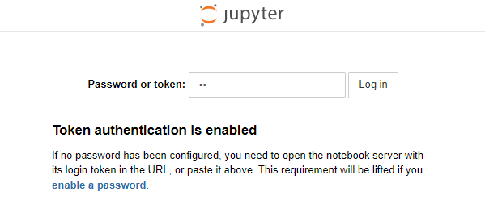
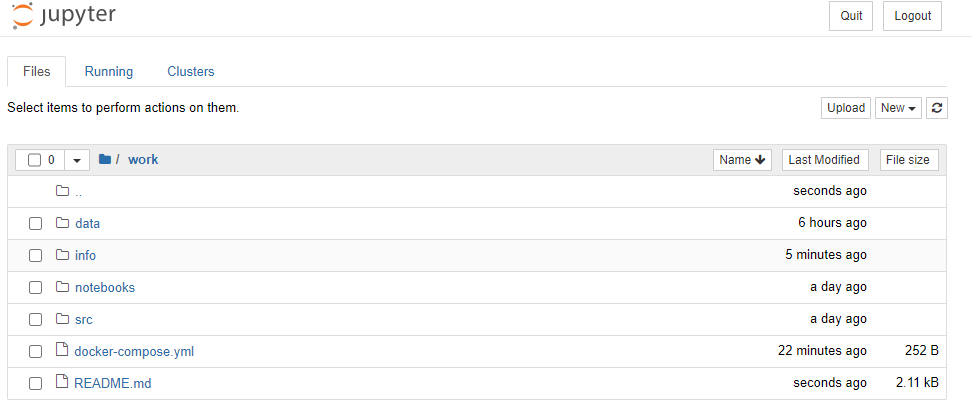
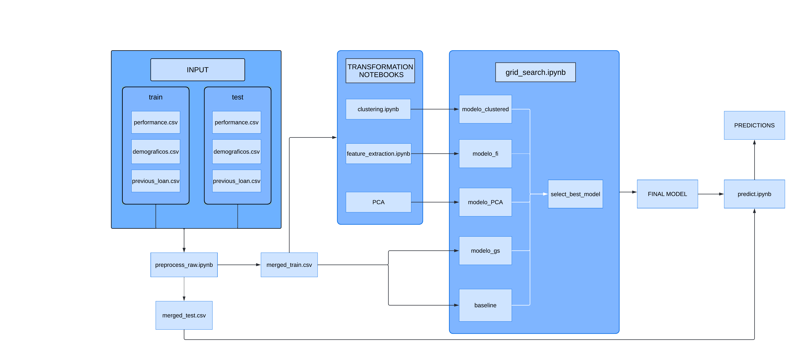

# G6_DP3
## Data Project 3: Evaluación del Riesgo Crediticio. - Master Data Analytics EDEM 2022

## Estructura del proyecto

```
G6_DP3
├───data                            # Datos usados en el proyecto
│   │
│   ├───input
│   │   ├───merged_data             # Conjuntos de datos de entrada de los modelos 
│   │   │
│   │   └───raw_data                # Conjuntos de datos input en crudo
│   │
│   └───output                      # Predicción de test y modelo final
│
│
├───info                            # Información general del proyecto
│
├───notebooks                                         
│   ├───modeling                    # Notebooks de generación y uso de modelos
│   │
│   ├───preprocess                  # Notebooks de preprocesado de datos input en crudo
│   │
│   └───transformations             # Notebooks de transformación de datasets input de los modelos
│
└───src                             # Códigos fuente de prueba

```

## Introducción:

## 0. Requisitos previos

El único requisito necesario a la hora de reproducir la solución es instalar [Docker](https://docs.docker.com/engine/install/) y [Git](https://git-scm.com/book/en/v2/Getting-Started-Installing-Git) en nuestros dispositivos. Completado este paso, clonamos este mismo repositorio:
```
git clone https://github.com/medinaltbx/G6_DP3.git
```

Una vez clonado el repositorio, accedemos al mismo y creamos el contenedor el cual contará con el entorno Jupyter:
```
docker-compose up -d --build 
```

Esperamos unos segundos a que carguen todos los componentes y nos dirigimos a la siguiente dirección usando cualquier navegador:
``
http://localhost:8888/
``



Completamos el campo "Password or token" con el token "**dp**", indicado en el archivo docker-compose.yml. Si todo ha ido bien, contaremos con acceso al proyecto cargado en el entorno Jupyter. Navegando dentro de la carpeta "work", observaremos la misma distribución de archivos y directorios que en el repositorio local previamente clonado:



## Arquitectura de la solución:



En primer lugar realizaremos una transformación y limpieza de los datos, de los cuales obtendremos dos conjuntos:

* **merged_train.csv**: Conjunto de datos con el cual entrenaremos y testearemos los modelos. Será subdividido en entrenamiento (75%) y validación (25%).
* **merged_test.csv**: Conjunto de datos sobre el que se realizará la clasificación una vez generado el modelo final.

Transformamos los datos de ambos conjuntos con los notebooks de transformación. En ellos, se realizará un análisis y se generarán tres datasets nuevos, los cuales también se subdividirán en entrenamiento y test (ambos representados por *):

* **cluster_**.csv : Contiene los mismos datos que merged_*.csv, añadiendo el resultado obtenido en la clusterización.
* **top_10_***.csv: Contiene las diez variables más significativas haciendo uso del atributo "feature_importances" del módulo XGBoostClassifier.
* **pca_***.csv: Dataset con nuevas variables obtenidas haciendo uso del método PCA.

Una vez obtenidos los nuevos datasets, pasaremos a entrenar cinco modelos haciendo uso del clasificador que nos proporciona la librería XGBoost. Todos los modelos son sometidos previamente a una búsqueda de los mejores [hiperparámetros](https://machinelearningmastery.com/difference-between-a-parameter-and-a-hyperparameter/) realizando el método [GridSearchCV](https://scikit-learn.org/stable/modules/generated/sklearn.model_selection.GridSearchCV.html), a excepción del modelo baseline que utilizaremos como punto de partida:

* **baseline_model**: Entrenado con merged_train.csv.
* **complete_model**: Entrenado con merged_train.csv.
* **cluster_model**: Entrenado con cluster_train.csv.
* **top_10_model**: Entrenado con top_10_train.csv.
* **pca_model**: Entrenado con pca_train.csv.

Posteriormente, comparamos todos los modelos haciendo uso de la métrica _accuracy_ y obtenemos aquel que cuente con la puntuación más alta. Con este modelo final realizaremos las predicciones sobre el conjunto de test correspondiente.

## 1. Ingesta y preprocesado

En primer lugar, para poder realizar cualquier tipo de análisis o clasificación debemos de preprocesar nuestros datos input. Contamos con tres datasets principales, los cuales a su vez se subdividen en entrenamiento y test:

* ***_datos_demograficos.csv** : Información sobre el cliente (edad, empleo, estudios, etc.).
* ***_performance.csv** : Conjunto de datos con préstamos a clasificar.
* ***_previous_loan.csv** : Préstamos históricos. Puede contener información de clientes presentes en *_performance.csv o no.

### Estrategia de preprocesado:

1. Realizamos un left join sobre performances y datos_demograficos. En este punto ya hemos unificado ambos datasets.
2. Transformamos el dataset previous_loan. Para cada entrada del mismo, generamos dos variables nuevas:
   1. **minutes_late**: Minutos de retraso en la devolución del prestamo. Calculada a partir de la diferencia de las columnas columnas "firstpaiddate" y "firstduedate".
   2. **is_late**: Indica si se ha retrasado en el pago. 1 si se ha retrasado y 0 en caso contrario.
3. Con estas nuevas columnas, agrupamos el dataset por cliente y generamos tres nuevas variables:
   1. **times_loaned**: Número de veces que el cliente ha recibido un préstamo con anterioridad.
   2. **times_late**: Número de veces que el cliente ha devuelto su préstamo tarde.
   3. **times_referred**: Número de veces que el cliente ha sido referido por otro cliente.
4. Una vez obtenidas estas columnas, realizamos un outer join con el dataset generado previamente, resultando en el dataset final **merged_*.csv*.

De esta forma generamos tanto merged_train.csv como merged_test.csv. Podemos replicarlo dirigiéndonos a ``work/notebooks/preprocess/raw_data.ipynb`` y ejecutando todas las celdas.

## 2. Transformación del input

### Clustering

### Feature importances
En primer lugar para realizar el Feature importances tenemos que descargar varias librerias en python(XgBoost, pandas,maplotlib), en segundo lugar llamaremos al archivo que se haya en github el cual cargaremos y haremos una limpieza de algunas variables para poder realizar el profiling de los datos el cual nos servirá para hacer algunos análisis de las variables.

En segundo lugar, realizaremos el modelo en xgboost el cual nos servirá para hayar las 10 variables más importantes y posteriormente crear un dataset con esas variables, dataset el cual utilizaremos para hacer el modelo final.

### PCA

## 3. Entrenamiento y modelo final

Una vez que contamos con todos los inputs necesarios, pasaremos a entrenar los modelos y medir sus errores con el conjunto de validación. En ``work/notebooks/modeling/grid_search.ipynb`` realizamos la búsqueda de hiperparámetros y entrenamos los modelos. Finalmente seleccionamos el mejor modelo siguiendo la estrategia mencionada en apartados anteriores y lo serializamos en la ruta `` work/data/output/best_model.pkl``

## 4. Predicción de conjunto de test

Finalmente, tan sólo nos queda realizar la predicción final sobre el conjunto de test. Si ejecutamos todas las celdas alojadas en ``work/notebooks/modeling/test_predictions.ipynb`` generamos un dataset que cuenta con el customerid y la predicción de si va a ser capaz de devolver el préstamo o no. Esta predicción final se encuentra en ``work/data/output/test_prediction.csv``. 
